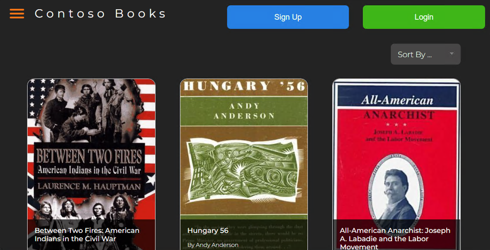

# Contoso Books

Contoso Books is the companion application for the **MongoDB to Azure DocumentDB Migration Workshop**. The workshop follows a realistic migration from a local MongoDB workload to Azure DocumentDB, covering environment setup, assessment, offline and online migration, validation, and the post-migration developer workflow.



## What the workshop demonstrates

- Running the Contoso Books application locally against MongoDB
- Configuring MongoDB as a single-node replica set for change-stream support
- Provisioning and connecting to an Azure DocumentDB target cluster
- Assessing MongoDB workload compatibility before migration
- Planning and executing offline snapshot migrations
- Executing online migrations while the source application continues accepting writes
- Validating document counts, application behavior, and data integrity after cutover
- Exploring migrated data, indexes, scaling, and metrics with Azure tools
- Using the same MongoDB driver-based application across local and Azure environments by changing its connection string
- Cleaning up the local and Azure resources created during the workshop

## Workshop exercises

| # | Exercise |
|---|---|
| 01 | [Environment Setup — Containerized MongoDB & Client App](docs/01_environment_setup/environment_setup.md) |
| 02 | [Target Environment Setup — Azure DocumentDB](docs/02_target_environment/target_environment.md) |
| 03 | [Migration Planning — Assessment with the DocumentDB Migration Extension for VS Code](docs/03_migration_planning/migration_planning.md) |
| 04 | [Migration Execution — Offline (Snapshot)](docs/04_migration_offline/migration_offline.md) |
| 05 | [Migration Execution — Online (Change Stream)](docs/05_migration_online/migration_online.md) |
| 06 | [Post-Migration Hardening — Azure DocumentDB Security Guidance & SFI](docs/06_post_migration/post_migration.md) |
| 07 | [Developer Workflow — A Local DocumentDB Development Loop](docs/07_developer_workflow/developer_workflow.md) |
| 08 | [Cleanup](docs/08_cleanup/cleanup.md) |

Start with the [workshop guide](docs/index.md) for the complete scenario, prerequisites, exercise sequence, and current duration estimates.

## Run the sample application locally

The sample application runs locally. Azure resources are introduced only when the workshop reaches the migration exercises.

### Prerequisites

- Docker Desktop
- Node.js 20.19 or later
- MongoDB Shell (`mongosh`)
- Git

The complete workshop also requires an Azure subscription, Azure CLI, VS Code, and the extensions listed in the [lab machine setup](docs/01_environment_setup/00_lab_machine_setup.md).

### 1. Start MongoDB

Start MongoDB 8.0 in a local container with replica set mode enabled:

```sh
docker run -d --name mongodb -p 27017:27017 mongo:8.0 --replSet rs0
```

After the container finishes starting, initialize the single-node replica set:

```sh
mongosh --eval 'rs.initiate({_id: "rs0", members: [{_id: 0, host: "localhost:27017"}]})'
```

### 2. Install the application

From the repository root:

```sh
cd src
npm install
```

Create `src/server/.env` with the local connection settings:

```dotenv
BOOKSTORE_DB_CONNECTION_STRING=mongodb://localhost:27017/?replicaSet=rs0
PORT=8080
```

### 3. Import the sample dataset

The dataset is bundled with the repository. Create `src/deployment/seed/.env` with the seeder's connection setting:

```dotenv
BOOKSTORE_SEED_DB_CONNECTION_STRING=mongodb://localhost:27017/?replicaSet=rs0
```

Then run the Node.js seeder:

```sh
cd deployment/seed
npm install
npm run seed
cd ../..
```

The seeder imports the bundled data into the `books` and `genres` collections in the `bookstore` database.

For responsive filtering and sorting over the full dataset, create the application indexes:

```javascript
mongosh
use bookstore
db.books.createIndex({ rating: 1 })
db.books.createIndex({ bookformat: 1 })
db.books.createIndex({ genre: 1 })
exit
```

### 4. Start the application

From `src/`, start the Express API and Vite client:

```sh
npm run develop
```

Open <http://localhost:3000> in a browser. The API runs on port `8080` and the Vite development server proxies application requests to it.

## Dataset credits

The bundled data is derived from the [GoodReads 100k books](https://www.kaggle.com/datasets/mdhamani/goodreads-books-100k) dataset on Kaggle. See the [seed data documentation](src/deployment/seed/data/README.md) for its license, document shape, and regeneration instructions.

## References

- [Azure DocumentDB documentation](https://learn.microsoft.com/azure/documentdb/)
- [Azure DocumentDB feature compatibility](https://learn.microsoft.com/azure/documentdb/compatibility-features)
