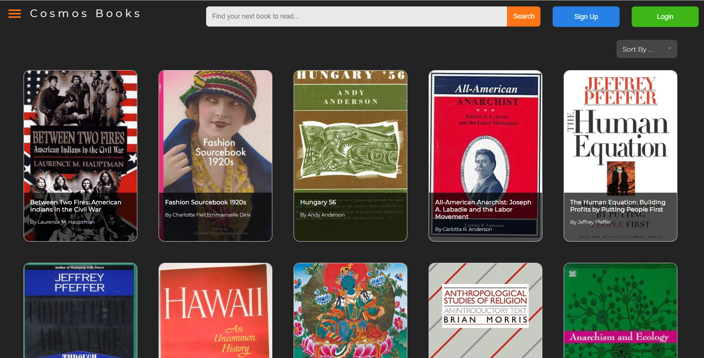

# Contoso Books

Contoso Books is a sample books catalog application that demonstrates the capabilities of Azure DocumentDB (the vCore-based, MongoDB wire-protocol-compatible service).

Some of the functionalities being demonstrated are:

- Connecting to the database & the client configuration
- Reads & Queries
- Sorting & Indexing
- Updates
- Using different operators
- Regex queries
- Aggregation pipelines

## Deploy the app quickly

Clone this repository and navigate to the root of the directory.

Follow the steps below to deploy the app with minimal effort and begin experimenting with the application and the codebase.

### Deploy the resources to Azure

The Bicep template at [src/deployment/main.bicep](src/deployment/main.bicep) provisions an Azure DocumentDB cluster (and a firewall rule for your client IP). Deploy it with the Azure CLI into a resource group:

```powershell
az group create --name rg-documentdb-lab --location westus3

az deployment group create `
  --resource-group rg-documentdb-lab `
  --name main `
  --template-file src/deployment/main.bicep `
  --parameters adminUsername=bookadmin clientIpAddress=<your-public-ip>
```

You will be prompted for the cluster administrator password (a `@secure()` parameter). The application itself runs locally — see [Connect to the application](#connect-to-the-application) below.

### Import the sample dataset into the Azure DocumentDB account

1. Navigate to folder ./src/deployment/seed using Git Bash.

2. Update .env file in this path by specifying value for "BOOKSTORE_SEED_DB_CONNECTION_STRING" of the database account created by the deployment template in the previous step.
   You can get the connection string from Azure portal > DocumentDB cluster resource > Connection strings blade.
   Example of updated .env file:
   BOOKSTORE_SEED_DB_CONNECTION_STRING="mongodb+srv://<user>:<password>@<cluster-name>.global.mongocluster.cosmos.azure.com/?tls=true&authMechanism=SCRAM-SHA-256&retrywrites=false&maxIdleTimeMS=120000"

3. Install dependencies and run the seed script with `npm install && npm run seed`. It may take a few minutes to seed the data into books and genres collections.\
   Item count of books collection is 96,419 and genres collection has only 1 item. \
   Successful run result looks like this:

```
$$$ Seeding data started 9/30/2021, 10:29:05 AM
Fetching books
Fetching genres
Seeding completed on genres Collection 9/30/2021, 10:29:10 AM
Seeding completed on books Collection 9/30/2021, 10:39:40 AM
```

> **Migration gotcha (intentional, for the lab):** DocumentDB (vCore) indexes only `_id` by default — unlike the older RU-based Cosmos DB for MongoDB API, which auto-indexes every field. The list page in this app filters on `rating`, `bookformat`, and `genre` and sorts on `rating`. Against a freshly-seeded cluster those queries will perform a full collection scan over 96,419 documents. After seeding, run the following in `mongosh` to make them performant:
>
> ```js
> use bookstore
> db.books.createIndex({ rating: 1 })
> db.books.createIndex({ bookformat: 1 })
> db.books.createIndex({ genre: 1 })
> ```

### Connect to the application

The application runs locally. From `src/`, install dependencies and start both tiers:

```powershell
npm install
npm run develop
```

This runs the API server (port 8080) and the Vite dev server (port 3000); open `http://localhost:3000` to browse the catalog. Point the app at your cluster by setting `BOOKSTORE_DB_CONNECTION_STRING` to the connection string from the previous section.



## Dataset Credits

The dataset used in this application is ["GoodReads 100k books"](https://www.kaggle.com/mdhamani/goodreads-books-100k) dataset from Kaggle.

## References

- [What is Azure DocumentDB?](https://learn.microsoft.com/azure/documentdb/introduction)
- [DocumentDB feature compatibility](https://learn.microsoft.com/azure/documentdb/compatibility-features)

## License

**Contoso Books** is licensed under the MIT license. See the [LICENSE](./LICENSE.txt) file for more details.
